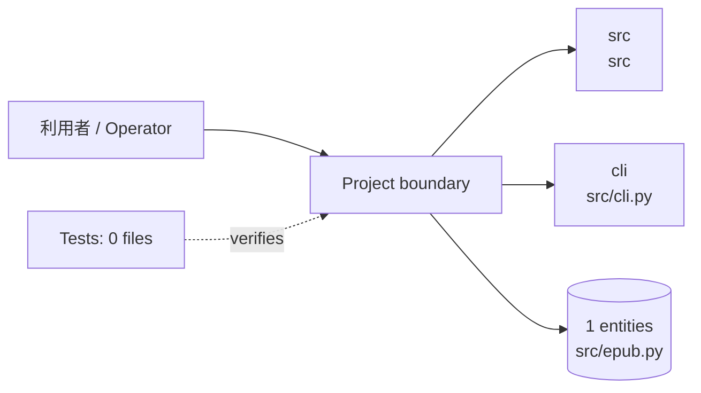
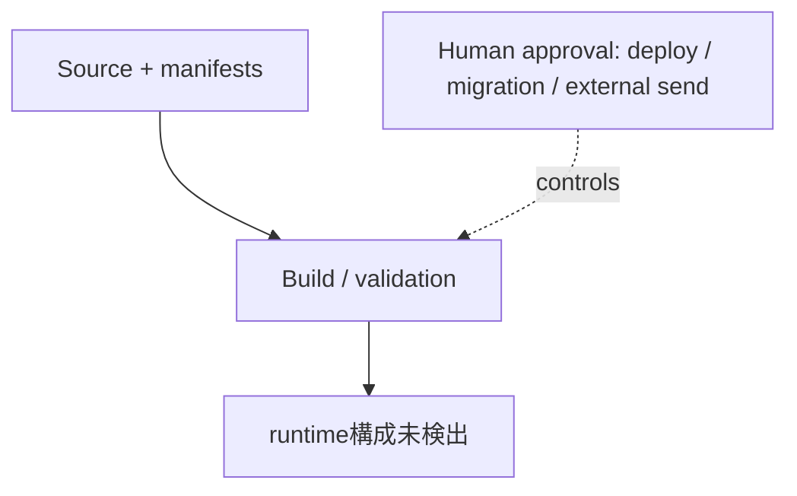

<!-- generated-by: scripts/generate_engineering_docs.py -->
# oreilly-epub-downloader — アーキテクチャ・システム構成

> 生成日: 2026-07-16 / 対象: `oreilly-epub-downloader` / 確度: [高]
> 実装・manifest・既存資料の静的棚卸しに基づく。外部サービスの稼働状態と本番構成は未検証。

## 論理アーキテクチャ

## 配備・実行構成

## コンポーネント責務

| Component | Path | 責務 |
|---|---|---|
| `src` | `src` | 中核実装。詳細は配下moduleを参照 |
| `cli` | `src/cli.py` | 実行entrypoint |

### 検出したruntime / service

- 構成ファイル未検出

## 実装境界

- UI/入口: UI route未検出
- API: API route未検出
- Data: `src/epub.py`
- External: integration名を静的検出できず

## セキュリティ境界

- 認証・回復性の実装シグナル: auth/session (`src/cookie_auth.py`), auth/session (`src/client.py`), resilience (`src/client.py`), auth/session (`src/cli.py`)
- 設定名: example/sourceから未検出（値は収集していない）
- deploy、migration、外部送信、課金はHuman Approval Gate対象。
